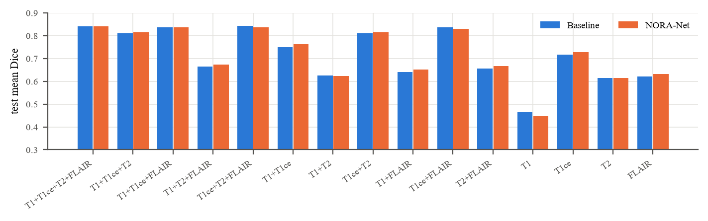

# NORA-Net: Robust and Explainable Multimodal Brain Tumor Segmentation via Shapley-Weighted Coalition Training and Normality-Referenced Probes

Official implementation of the NORA-Net paper.

**Suyash Kumar, Kushel Rohilla, Kanishka Yadav, Aryan Yadav, Kartik**

<p align="center"></p>

## Abstract

Automatic glioma segmentation relies on four co-registered MRI sequences. In practice, though, a sequence can be
missing or only partly acquired, and the explanation maps that come with deep models are rarely checked against what the
model actually uses.

NORA-Net is a 3D segmentation model whose segmentation network is a plain shared-encoder U-Net. Its contributions lie
outside that architecture: in the training procedure, and in probes on detached features that cannot change the
segmentation.

1. **Shapley-weighted coalition training.** On half of the training steps the model sees a random subset of the
   available sequences, drawn with exactly the Shapley weights, and is distilled from its own full-input prediction.
2. **Amortized Shapley head.** The same coalition passes train a head that outputs, in one forward pass, voxel-wise
   Shapley maps of every sequence for every tumor region. An efficiency projection makes the maps sum to the prediction.
3. **Normality-referenced probe.** Detached features are compared with per-sequence prototypes of healthy tissue and
   with a label-free patient-specific memory. This yields abnormality maps and the pooling weights of an HGG/LGG grade
   head.

A voxel-level availability mask lets every component handle partially missing sequences. We evaluate against exact
voxel-wise Shapley values over all 16 sequence subsets, on all 15 incomplete-input settings, and on a synthetic
partial-field-of-view benchmark.

## Results

BraTS 2020, patient-level split stratified by grade (258 / 37 / 74). Test set of 74 patients, last checkpoint. The
baseline is the same network, trained with matched sequence dropout. "TTA + post-proc.": 8-flip test-time augmentation
with the ET gate tuned on the validation set.

| Method | Dice WT | Dice TC | Dice ET | Mean Dice | HD95 mean (mm) | Params |
|---|---|---|---|---|---|---|
| Baseline | 90.58 | 84.65 | 77.12 | 84.12 | 11.36 | 7.90 M |
| **NORA-Net** | 90.56 | 84.01 | 77.50 | 84.02 | 11.76 | 7.97 M |
| Baseline + TTA + post-proc. | 90.78 | 85.41 | 78.62 | 84.94 | 10.51 | 7.90 M |
| **NORA-Net** + TTA + post-proc. | 90.66 | 84.48 | 77.81 | 84.32 | 13.64 | 7.97 M |

Mean Dice differences are not significant (paired Wilcoxon, p = 0.96 plain, p = 0.83 with TTA).

**Missing and partially missing sequences** (plain inference, 74 test patients):

| Setting | Baseline | NORA-Net | p |
|---|---|---|---|
| Mean Dice, average over the 14 incomplete sequence subsets | 70.62 | 70.94 | 0.51 |
| Mean-Dice drop vs. full input (points) | 13.49 | 13.08 | |
| Synthetic partial field of view: one sequence blanked over 30–60 % of the brain, mean Dice | 82.42 | 81.97 | 0.94 |
| Mean-Dice drop vs. clean input (points) | 1.70 | 2.06 | 0.92 |

Coalition training matches modality dropout at a matched rate but does not beat it: the gain we targeted before training
(at least 1 point less drop) is not reached. Both models depend mainly on T1ce for the tumor core and enhancing tumor.

<p align="center"></p>

What the probes add, from the same forward pass:

| Output | Result |
|---|---|
| Abnormality map: tumor vs. healthy brain (AUROC) | 0.981 |
| Shapley head vs. exact Shapley values (Spearman, \|φ\|) / top-1 sequence agreement | 0.284 / 0.639 |
| Calibration error ECE (WT / TC / ET, %) | 0.81 / 0.73 / 0.48 |
| HGG/LGG grading: balanced accuracy / AUROC (CAAP vs. GAP baseline) | 0.62 / 0.82 vs. 0.50 / 0.71 |

Per-patient numbers for every table are in [`results/`](results). The evaluation outputs (TTA, all 15 sequence subsets,
partial field of view) are in [`results/v3/eval/`](results/v3/eval).

<p align="center"></p>

## Installation

```bash
git clone https://github.com/itsWindi/nora-net.git && cd nora-net
pip install -r requirements.txt     # PyTorch >= 2.1 (CUDA recommended for training)
```

## Pretrained models

The two models evaluated in the paper are in [`checkpoints/`](checkpoints). Each is the last checkpoint after 15,000
iterations (the paper's primary result), stored as weights plus training configuration (about 31 MB each; checksums in
`checkpoints/SHA256SUMS`).

| File | Model | Outputs |
|---|---|---|
| `checkpoints/nora_v3_last.pt` | NORA-Net | segmentation, uncertainty, voxel-wise Shapley maps per sequence, abnormality map, HGG/LGG probability |
| `checkpoints/baseline_v3_last.pt` | baseline | segmentation, uncertainty, HGG/LGG probability |

## Inference on your own scans

The models expect BraTS-style input: co-registered, skull-stripped T1, T1ce, T2 and FLAIR at 1 mm isotropic
resolution (the BraTS 240×240×155 space). Put each patient in its own folder; files are matched by their suffix:

```
my_cases/
  patient01/  patient01_t1.nii.gz  patient01_t1ce.nii.gz  patient01_t2.nii.gz  patient01_flair.nii.gz  [patient01_seg.nii.gz]
  patient02/  ...
```

```bash
python infer.py --cases my_cases --ckpt checkpoints/nora_v3_last.pt --out runs/infer          # CPU is enough (~1 min/case)
python infer.py --cases my_cases --ckpt checkpoints/nora_v3_last.pt checkpoints/baseline_v3_last.pt --tta   # both models, 8-flip TTA
```

For every case and model, `--out` receives:
- `<case>_<model>_pred.nii.gz`: segmentation in the input space, BraTS labels (1 necrosis/non-enhancing, 2 edema, 4 enhancing).
- `<case>_<model>_unc.npy`: whole-tumor uncertainty.
- `<case>_nora_v3_maps.npz` (NORA-Net only): `phi`, the Shapley map of each sequence for each region, and `abn`, the abnormality map. Both are given on the cropped grid in `crop`.
- `local_results.json`: Dice and HD95 if a `_seg` file is present, the HGG probability, and the runtime.
- `comparison.png`: a quick visual check.

A missing sequence file is allowed: that sequence is marked unavailable and the model runs on the rest. Blank regions
inside a sequence (partial field of view) are detected automatically. `--drop t1ce flair` additionally evaluates each
case with those sequences removed.

The predictions are for research use only and are not a medical device.

## Data

Download the BraTS 2020 training data (369 patients) and accept the BraTS data terms, e.g. from the Kaggle dataset
`awsaf49/brats20-dataset-training-validation`. Point `--data-root` at any folder that contains the
`BraTS20_Training_XXX/` case folders and `name_mapping.csv` (they are found recursively). On the first run the scans are
preprocessed once into `--cache`: crop, availability mask, per-sequence normalisation. The patient split is
deterministic (seed 42) and is saved to `split.json`; the split used in the paper is `results/split.json`.

## Training

Each model trains on one 16 GB GPU (the paper used NVIDIA T4 GPUs): 15,000 iterations of 128³ patches, batch size 1,
mixed precision. That took about 5.3 h for NORA-Net and 3.7 h for the baseline.

```bash
# NORA-Net
python -m nora.train_loop --tag nora_v3 --data-root <BraTS2020_TrainingData> --cache cache --out runs \
    --max-iters 15000 --val-every 4 --val-cases 37 --shapley-cases 15 --test-ckpt both

# Baseline: same network, matched sequence dropout, no coalitions / probes, GAP grade head
python -m nora.train_loop --tag base_v3 --data-root <BraTS2020_TrainingData> --cache cache --out runs \
    --max-iters 15000 --val-every 4 --val-cases 37 --shapley-cases 15 --test-ckpt both \
    --coalition-prob 0 --no-shapley-head --no-probe --grade-pool gap --mod-drop 0.375
```

Training validates on all validation patients, always validates the final weights, saves `<tag>_last.pt` (the primary
result) and `<tag>_best.pt`, and finally tests on the 74 test patients (`<tag>_test_results.json`). This includes exact
Shapley explanations for 15 stratified test patients.

## Evaluation

```bash
# TTA + post-processing statistics, all 15 sequence subsets, synthetic partial field of view
python -m nora.evaluate --tasks eval,robust,pfov --only-last --tag nora_v3 \
    --last runs/nora_v3_last.pt --split runs/split.json --data-root <BraTS2020_TrainingData> --cache cache --out runs/eval
```

To evaluate the released models instead of your own training run, pass `--last checkpoints/nora_v3_last.pt` and
`--split results/split.json`.

Unit tests: `python tests/test_model.py`.

## Repository structure

```
nora/
  data.py        discovery, preprocessing with availability masks, patient-level split, patch sampling
  model.py       segmentation network, Shapley head, normality probe, grade head
  losses.py      evidential, Dice, calibration, distillation, Shapley regression and normality losses
  metrics.py     Dice / HD95 / ECE / AUROC, sliding-window inference with TTA, post-processing, exact Shapley
  train.py       arguments, Shapley-weighted coalition sampling, per-step losses, evaluation and explanations
  train_loop.py  training driver (GPU augmentation, validation, checkpointing, testing)
  evaluate.py    post-training evaluation: TTA, 15 sequence subsets, partial field of view, exact Shapley
infer.py         inference on raw BraTS NIfTI cases
checkpoints/     the two trained models of the paper (last checkpoint, weights only)
tests/           CPU unit tests
legacy/v2/       the preliminary version discussed in the paper (training code)
results/         per-patient test metrics, training curves and logs behind the paper's tables and figures
assets/          figures used in this README
```

**Design history.**
- v1: a design study only, not implemented.
- v2: placed the normality memory and learned fusion inside the segmentation network. It reached parity on Dice but
  was less robust to missing sequences ([`legacy/v2`](legacy/v2)).
- v3: this repository. It keeps a plain segmentation network and moves the contributions into training and probes.

## Citation

```bibtex
@article{noranet,
  title  = {NORA-Net: Robust and Explainable Multimodal Brain Tumor Segmentation via Shapley-Weighted Coalition
            Training and Normality-Referenced Probes},
  author = {Kumar, Suyash and Rohilla, Kushel and Yadav, Kanishka and Yadav, Aryan and Kartik},
  year   = {2026},
  url    = {https://github.com/itsWindi/nora-net}
}
```

## Acknowledgements

The BraTS 2020 data were provided by the organizers of the Multimodal Brain Tumor Segmentation Challenge. Training used
GPU resources provided by Kaggle.

## License

To be decided by the authors. Until a license file is added, all rights are reserved.
