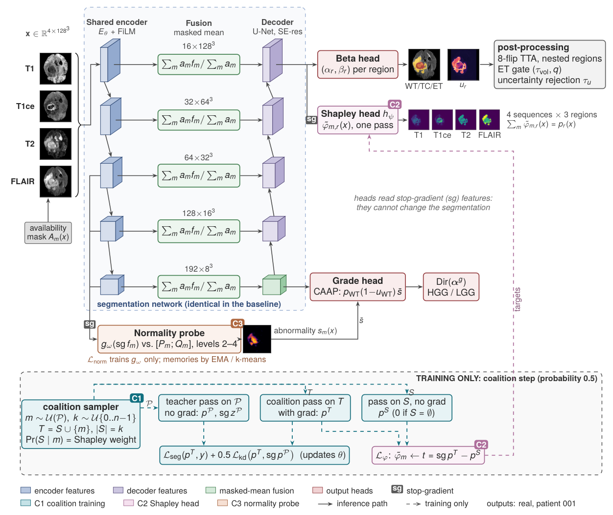
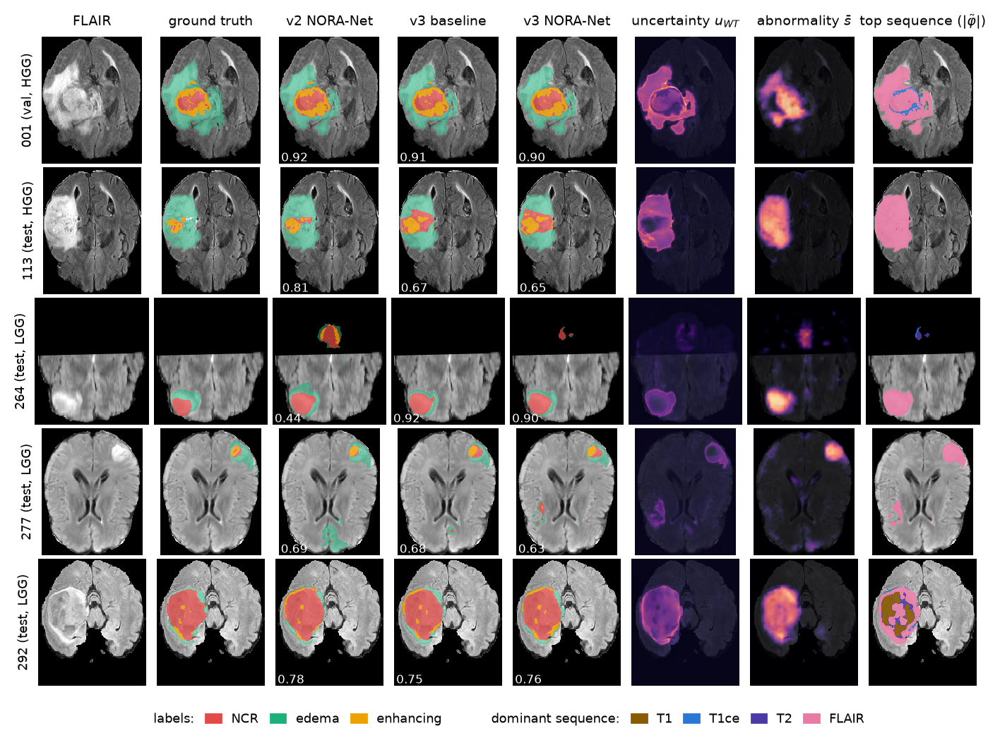

# NORA-Net: Robust and Explainable Multimodal Brain Tumor Segmentation via Shapley-Weighted Coalition Training and Normality-Referenced Probes

Official implementation of the NORA-Net paper.

**Authors:** _to be added_ · **Paper:** _link to be added_

<p align="center"></p>

## Abstract

Automatic glioma segmentation relies on four co-registered MRI sequences. In practice, though, a sequence can be
missing or only partly acquired, and the explanation maps that come with deep models are rarely checked against what the
model actually uses.

NORA-Net is a 3D segmentation model whose segmentation network is a plain shared-encoder U-Net. Its contributions lie
outside that architecture: in the training procedure, and in probes on detached features that cannot change the
segmentation.

1. **Shapley-weighted coalition training.** On half of the training steps the model sees a random subset of the
   available sequences, drawn with exactly the Shapley weights, and is distilled from its own full-input prediction.
2. **Amortized Shapley head.** The same coalition passes train a head that outputs, in one forward pass, voxel-wise
   Shapley maps of every sequence for every tumor region. An efficiency projection makes the maps sum to the prediction.
3. **Normality-referenced probe.** Detached features are compared with per-sequence prototypes of healthy tissue and
   with a label-free patient-specific memory. This yields abnormality maps and the pooling weights of an HGG/LGG grade
   head.

A voxel-level availability mask lets every component handle partially missing sequences. We evaluate against exact
voxel-wise Shapley values over all 16 sequence subsets, on all 15 incomplete-input settings, and on a synthetic
partial-field-of-view benchmark.

## Results

BraTS 2020, patient-level split stratified by grade (258 / 37 / 74). Test set of 74 patients, last checkpoint, one
sliding-window pass. The baseline is the same network, trained with matched sequence dropout.

| Method | Dice WT | Dice TC | Dice ET | Mean Dice | HD95 mean (mm) | Params |
|---|---|---|---|---|---|---|
| Baseline | 90.58 | 84.65 | 77.12 | 84.12 | 11.36 | 7.90 M |
| **NORA-Net** | 90.56 | 84.01 | 77.50 | 84.02 | 11.76 | 7.97 M |

What the probes add, from the same forward pass:

| Output | Result |
|---|---|
| Abnormality map: tumor vs. healthy brain (AUROC) | 0.981 |
| Shapley head vs. exact Shapley values (Spearman, \|φ\|) / top-1 sequence agreement | 0.284 / 0.639 |
| Calibration error ECE (WT / TC / ET, %) | 0.81 / 0.73 / 0.48 |
| HGG/LGG grading: balanced accuracy / AUROC (CAAP vs. GAP baseline) | 0.62 / 0.82 vs. 0.50 / 0.71 |

Missing-sequence (15 subsets) and partial-field-of-view results are in the paper. Per-patient numbers for every table
are in [`results/`](results).

<p align="center"></p>

## Installation

```bash
git clone <repository-url> && cd NORA-Net
pip install -r requirements.txt     # PyTorch >= 2.1 (CUDA recommended for training)
```

## Data

Download the BraTS 2020 training data (369 patients) and accept the BraTS data terms, e.g. from the Kaggle dataset
`awsaf49/brats20-dataset-training-validation`. Point `--data-root` at any folder that contains the
`BraTS20_Training_XXX/` case folders and `name_mapping.csv` (they are found recursively). On the first run the scans are
preprocessed once into `--cache`: crop, availability mask, per-sequence normalisation. The patient split is
deterministic (seed 42) and is saved to `split.json`; the split used in the paper is `results/split.json`.

## Training

Each model trains on one 16 GB GPU (the paper used NVIDIA T4 GPUs): 15,000 iterations of 128³ patches, batch size 1,
mixed precision. That took about 5.3 h for NORA-Net and 3.7 h for the baseline.

```bash
# NORA-Net
python -m nora.train_loop --tag nora_v3 --data-root <BraTS2020_TrainingData> --cache cache --out runs \
    --max-iters 15000 --val-every 4 --val-cases 37 --shapley-cases 15 --test-ckpt both

# Baseline: same network, matched sequence dropout, no coalitions / probes, GAP grade head
python -m nora.train_loop --tag base_v3 --data-root <BraTS2020_TrainingData> --cache cache --out runs \
    --max-iters 15000 --val-every 4 --val-cases 37 --shapley-cases 15 --test-ckpt both \
    --coalition-prob 0 --no-shapley-head --no-probe --grade-pool gap --mod-drop 0.375
```

Training validates on all validation patients, always validates the final weights, saves `<tag>_last.pt` (the primary
result) and `<tag>_best.pt`, and finally tests on the 74 test patients (`<tag>_test_results.json`). This includes exact
Shapley explanations for 15 stratified test patients.

## Evaluation

```bash
# TTA + post-processing statistics, all 15 sequence subsets, synthetic partial field of view
python -m nora.evaluate --tasks eval,robust,pfov --only-last --tag nora_v3 \
    --last runs/nora_v3_last.pt --split runs/split.json --data-root <BraTS2020_TrainingData> --cache cache --out runs/eval
```

Inference on raw NIfTI cases (CPU is enough), with predictions written in the original 240×240×155 space:

```bash
python infer.py --cases <folder of BraTS20_Training_XXX/> --ckpt runs/nora_v3_last.pt runs/base_v3_last.pt --out runs/infer
```

Unit tests: `python tests/test_model.py`.

## Repository structure

```
nora/
  data.py        discovery, preprocessing with availability masks, patient-level split, patch sampling
  model.py       segmentation network, Shapley head, normality probe, grade head
  losses.py      evidential, Dice, calibration, distillation, Shapley regression and normality losses
  metrics.py     Dice / HD95 / ECE / AUROC, sliding-window inference with TTA, post-processing, exact Shapley
  train.py       arguments, Shapley-weighted coalition sampling, per-step losses, evaluation and explanations
  train_loop.py  training driver (GPU augmentation, validation, checkpointing, testing)
  evaluate.py    post-training evaluation: TTA, 15 sequence subsets, partial field of view, exact Shapley
infer.py         inference on raw BraTS NIfTI cases
tests/           CPU unit tests
legacy/v2/       the preliminary version discussed in the paper (training code)
results/         per-patient test metrics, training curves and logs behind the paper's tables and figures
assets/          figures used in this README
```

**Design history.**
- v1: a design study only, not implemented.
- v2: placed the normality memory and learned fusion inside the segmentation network. It reached parity on Dice but
  was less robust to missing sequences ([`legacy/v2`](legacy/v2)).
- v3: this repository. It keeps a plain segmentation network and moves the contributions into training and probes.

## Citation

```bibtex
@article{noranet,
  title  = {NORA-Net: Robust and Explainable Multimodal Brain Tumor Segmentation via Shapley-Weighted Coalition
            Training and Normality-Referenced Probes},
  author = {To be added},
  year   = {2026}
}
```

## Acknowledgements

The BraTS 2020 data were provided by the organizers of the Multimodal Brain Tumor Segmentation Challenge. Training used
GPU resources provided by Kaggle.

## License

To be decided by the authors. Until a license file is added, all rights are reserved.
